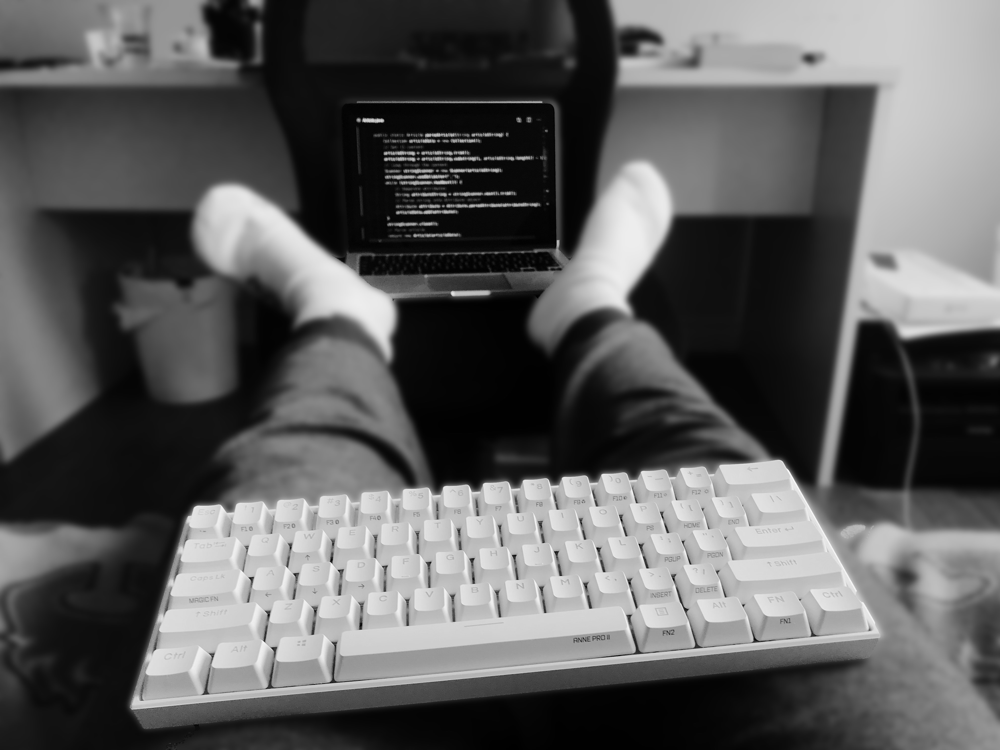
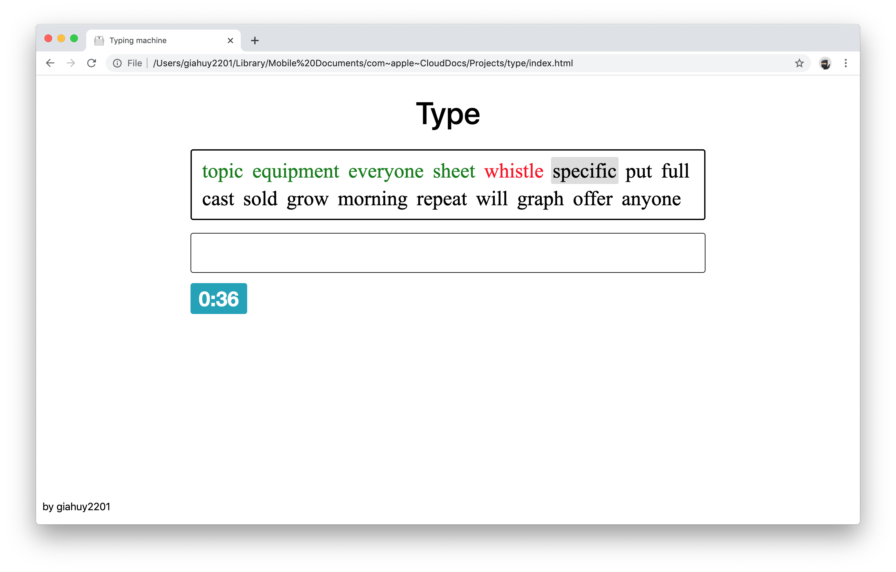
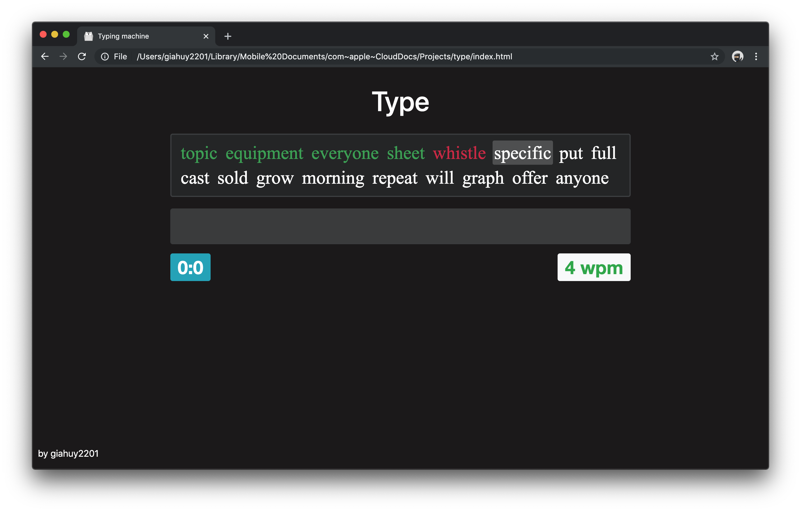
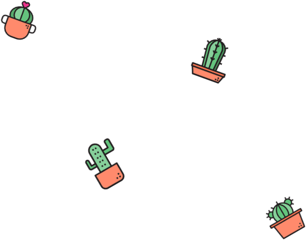
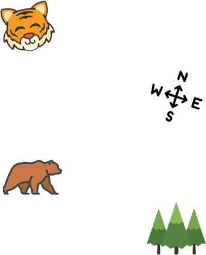
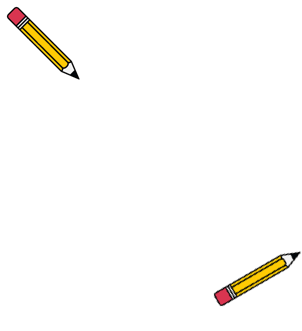

# Type - typing machine ⌨️

A static webpage to test your typing speed.

Last month, I bought myself a keyboard to avoid sticking with my laptop all day since i noticed the deterioration of my eyes and wrists. The new keyboard - Anne Pro 2 - is white wireless 60%-sized, and it gives me a wonderful time typing and flexible posture. I love it so far. And because i like to type, I had a long time practicing it on [10fastfingers](https://10fastfingers.com). But the fact that the website requires Internet to get the results which i have little care for and the boring interface encourages me to make a own version.

This is my first serious static web project, and I'm building things from zero to learn more on-the-fly and get better at design and code organization. Thus, there are many mistakes need to be get away with.

## Features

### 1. Typing modes

#### Easy

Restrict the length of each word generated to less than 6 character.

#### Left hand

Generate words that can be typed using only left hand. Specifically for those who want to practice one hand at the time like me 😆

#### Right hand

Similarly, but words generated for right hand only typing.

### 2. Dark mode

Allow 2 flexible appearance mode with the switch as simple as a click. Also, dark mode can be set to auto by a checkbox

|        Dark mode off         |        Dark mode on         |
| :--------------------------: | :-------------------------: |
|  |  |

### 3. Themes

Make your typing machine a bit customized by set your favorite theme. It currently haves 3 avaible themes, and will get more in later update. And the themes are made to compatible with dark mode.

1. Cacti

   

2. Flora

   

3. School

   

[Try](https://giahuy2201.github.io/Type) and see it yourself!

## Issues

To be updated

## Notes

- I also included a sketch design file for those interested in; I am not a desginer though.
